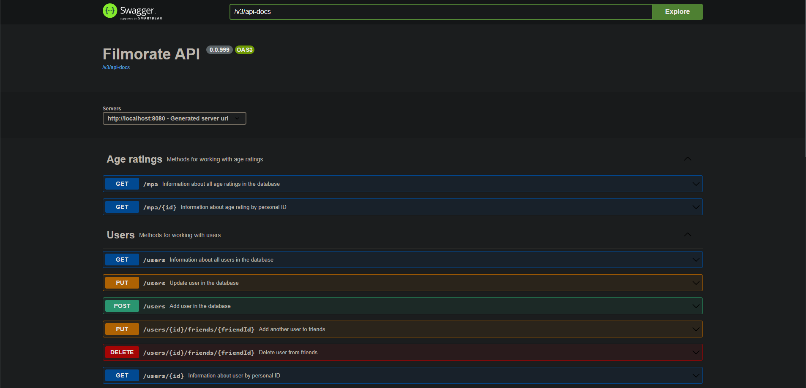
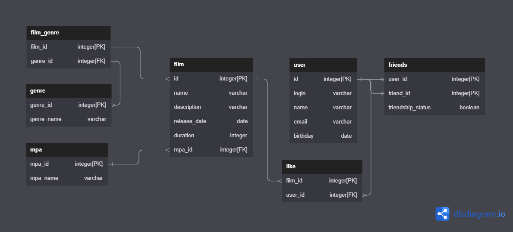

# Filmorate API

A group project implemented as a monolithic application. It is a service for rating and recommending films between users.

## Swagger UI

For more details you can go on **localhost:8080/swagger-ui.html** when the app has been started
and explore API from your browser



## Database diagram



## What can we get from this database:

### User:

+ Get all users
+ Get user by id
+ Remove user by id
+ Get users friends
+ Add user to friends
+ Remove user from friends
+ Get common friends
+ Check friendship status

### Film:

+ Get all films
+ Add film
+ Get film by id
+ Remove film by id
+ Get film genres
+ Get most popular films
+ Get film likes

### Review
+ Add review to film
+ Add like to review
+ Remove like from review
+ Get review by user id
+ Get all review
+ Get reviews by film id
+ Remove review by id

### Director
+ Get all films by director id
+ Get all directors
+ Get director by film id

### Events
+ Get all events
+ Get events by user id
+ Get events by entity id
+ Get events by event_type id

## Examples

Get user friends

```postgres-psql
SELECT * FROM USERS 
WHERE ID IN (SELECT FRIEND_ID FROM FRIENDS WHERE USER_ID = ?)
 ```

Get genres by film id

```postgres-psql
SELECT * FROM GENRE 
WHERE GENRE_ID IN 
(SELECT GENRE_ID FROM FILM_GENRE WHERE FILM_ID = ?)
 ```

Get films of concrete genre

```postgres-psql
SELECT * FROM FILMS f
JOIN FILM_GENRE fg ON f.ID = fg.FILM_ID
WHERE fg.GENRE_ID = ?
 ```
