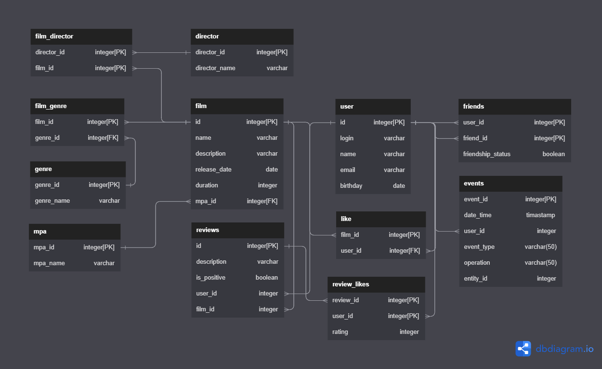

# java-filmorate
Template repository for Filmorate project.

## Database diagram

## What can we get from database:
### User:
+ Get all users
+ Get user by ID
+ Get users friends
+ Get common friends
+ Check friendship status
+ etc
### Film:
+ Get all films
+ Get film by ID
+ Get film genre
+ Get most popular films
+ Get film likes
+ etc

## Examples
Get user friends
```postgres-psql
SELECT *
FROM user
WHERE fr.user_id = ? AND fr.frienship_status_id = ?
JOIN friends AS fr ON user.id=fr.user_id
JOIN frienship_status AS fs ON fr.friendship_status_id=fs.status_id
GROUP BY fr.user_id;
 ```


Get films of a specific genre
```postgres-psql
SELECT *
FROM film
WHERE fg.genre_id = ? AS genre
JOIN film_genre AS fg ON fg.film_id=film.id
GROUP BY genre;